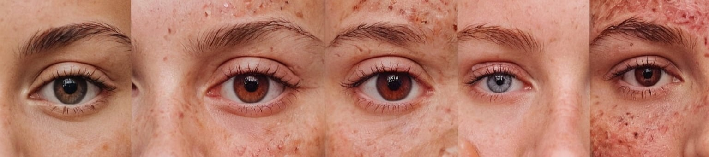

# Skin Cancer Detection & Classification using Deep Learning



## Table of Contents

- [Introduction](#introduction)
- [Features](#features)
- [Installation](#installation)
- [Usage](#usage)
- [Dataset](#dataset)
- [Model Architecture](#model-architecture)
- [Training](#training)
- [Evaluation](#evaluation)
- [Prediction](#prediction)
- [Contributing](#contributing)
- [License](#license)

## Introduction

Skin cancer is one of the most prevalent types of cancer worldwide. Early detection plays a crucial role in successful treatment outcomes. Traditional diagnosis methods often rely on manual inspection by dermatologists, which can be time-consuming and subjective. This project aims to develop a deep learning model capable of accurately classifying skin lesions into different types of skin cancer, providing a faster and more objective diagnostic tool.

## Features

- **Skin Lesion Classification**: The model can classify skin lesions into one of five categories: Basal cell carcinoma, Melanoma, Nevus, Benign keratosis, or No cancer.
- **Transfer Learning**: Leveraging the MobileNetV2 architecture pre-trained on ImageNet, we fine-tune the model on our specific task to achieve high accuracy.
- **Data Augmentation**: Data augmentation techniques are applied during training to improve the model's generalization ability.
- **Confusion Matrix Visualization**: Evaluate the model's performance using a confusion matrix to understand its classification behavior across different classes.

## Installation

1. Clone this repository to your local machine:
   ```bash
   git clone https://github.com/Student408/Skin-Cancer-Detection-Classification.git
   ```

2. Install the required dependencies listed in `requirements.txt`:
   ```bash
   pip install -r requirements.txt
   ```

   For Windows users using GPU, please refer to [TensorFlow installation guide](https://www.tensorflow.org/install/source_windows#gpu).

## Usage

1. Download the dataset from [ISIC Challenge](https://challenge.isic-archive.com/data).
2. Download the pre-trained MobileNetV2 model weights.
3. Run the Jupyter Notebook or Python script provided in the repository to:
   - Train the model on the dataset.
   - Evaluate the trained model's performance.
   - Make predictions on new skin lesion images.

   Additional resources:
   - [Keras ImageDataGenerator and Data Augmentation](https://pyimagesearch.com/2019/07/08/keras-imagedatagenerator-and-data-augmentation/)
   - [Keras Applications](https://keras.io/api/applications/)

## Dataset

The dataset used for this project consists of a large collection of skin lesion images annotated with their corresponding labels. The dataset is split into training and testing sets, with a distribution of images across different classes. More information about the dataset and its source can be found [here](https://challenge.isic-archive.com/data).

## Model Architecture

We employ transfer learning by utilizing the MobileNetV2 architecture pre-trained on the ImageNet dataset. The final layers of the MobileNetV2 model are replaced with custom fully connected layers for fine-tuning on the skin cancer classification task. The model architecture ensures efficient training and high performance in terms of accuracy and computational efficiency.

## Training

The model is trained using the training set with data augmentation techniques applied to enhance its ability to generalize to unseen data. The training process involves multiple epochs, with early stopping employed to prevent overfitting. Additionally, a learning rate scheduler adjusts the learning rate during training to optimize convergence.

## Evaluation

After training, the model's performance is evaluated on the test set to assess its classification accuracy and generalization ability. Evaluation metrics such as accuracy, precision, recall, and F1-score are computed, along with a confusion matrix visualization to analyze the model's classification behavior across different classes.

## Prediction

A prediction function is provided to make predictions on new skin lesion images. Simply provide the URL of the image as input, and the function will return the predicted class along with the probabilities of each class.

## Contributing

Contributions are welcome! If you find any issues or have suggestions for improvement, please feel free to open an issue or create a pull request.

   Additional tools used in this project:
   - [Google Drive Zip File Extraction](https://github.com/Student408/Google-Drive-Zip-File-Extraction)
   - [Image Dataset Splitter](https://github.com/Student408/Image-Dataset-Splitter)
   - [Image Labeling](https://github.com/Student408/Image-labeling)

## License

This project is licensed under the Apache-2.0 license - see the [LICENSE](LICENSE) file for details.


This project is made possible with the assistance of ChatGPT.

